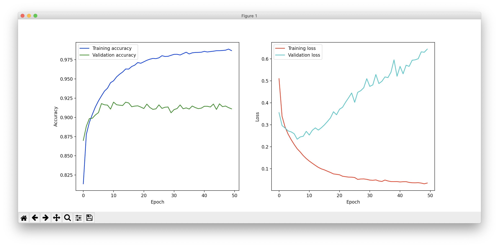
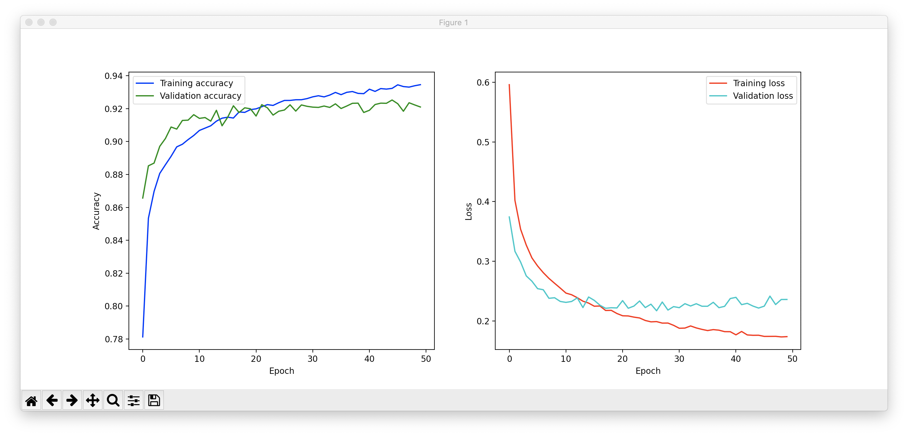

# Fashion-MNIST

## Introduction

`Fashion-MNIST` is a dataset [Zalando](https://jobs.zalando.com/tech/)'s article images.

The Fashion-MNIST dataset includes the following data:

* training set of 60,000 examples
* test set of 10,000 examples

Each example is 28x28 single channeled, grayscale image, associated with one of then following classes:

| Label | Description |
| --- | --- |
| 0 | T-shirt/top |
| 1 | Trouser |
| 2 | Pullover |
| 3 | Dress |
| 4 | Coat |
| 5 | Sandal |
| 6 | Shirt |
| 7 | Sneaker |
| 8 | Bag |
| 9 | Ankle boot |


The goal is to develop convolutional neural network for clothing classification.

## Methods
### Data preprocessing

At first, all the images and labels have been preprocessed by following steps:

1. Each training image has been set to numpy array with `dtype='float32'`
2. The training labels have been converted to binary class vector

Secondly, from all the training data, I've separated four sets:

1. x_train - training set of images, containing 80% of all images
2. x_val - validation set of images, containing 20% of all images
3. y_train - training set of labels, containing 80% of all labels
4. y_val - validation set of labels, containing 20% of all labels

### Model

I decided to develop Sequential model, which represents linear stack of layers

#### First version of model

```python
def get_model():
    model = Sequential()
    model.add(Conv2D(64, kernel_size=3, activation='relu', input_shape=(img_width, img_height, 1)))
    model.add(MaxPooling2D(pool_size=(pool_size, pool_size)))

    model.add(Conv2D(64, kernel_size=3, activation='relu'))
    model.add(MaxPooling2D(pool_size=(pool_size, pool_size)))

    model.add(Flatten())
    model.add(Dense(128, activation='relu'))
    model.add(Dropout(0.2))
    model.add(Dense(10, activation='softmax'))

    model.compile(optimizer='adam', loss='categorical_crossentropy', metrics=['accuracy'])

    return model
```

There are two convolutional layers, first with 64 filters with 3x3 size, and second
with 64 filters also with 3x3 size. In both layers, the activation function is `relu`.
After each convolutional layer, there is a pooling layer with kernel size 2x2.
Then, outputs from previous layers are being flattened into a vectors and fed into
two fully connected layers with dropout between them.

Since I'm dealing with multi-classes output
my loss function is going to be cross entropy function and my accuracy metric
is going to be regular accuracy which calculates how often prediction was equal
to actual output label. I chose `adam` for optimization algorithm.

#### Improved version of model

```python
def get_model():
    model = Sequential()
    model.add(Conv2D(32, kernel_size=3, activation='relu', input_shape=(img_width, img_height, 1)))
    model.add(MaxPooling2D(pool_size=(pool_size, pool_size)))
    model.add(Dropout(0.25))

    model.add(Conv2D(64, kernel_size=3, activation='relu'))
    model.add(MaxPooling2D(pool_size=(pool_size, pool_size)))
    model.add(Dropout(0.3))

    model.add(Flatten())
    model.add(Dense(128, activation='relu'))
    model.add(Dropout(0.3))
    model.add(Dense(10, activation='softmax'))

    model.compile(optimizer='adam', loss='categorical_crossentropy', metrics=['accuracy'])

    return model
```

Unfortunately, the performance of the model wasn't the best - after 5-7th epoch
training accuracy stoped growing and validation loss was increasing drastically
(The plots are placed in results section).
To avoid overfitting I've decided to put some dropout layers - one after each
convolutional layer. I also slightly changed number of filters in layers -
now it is respectively 32 and 64.

### Training

```python
def model_training(train_images, train_labels, iterations):
    x_train, x_val, y_train, y_val = train_test_split(train_images, train_labels,
                                                      test_size=0.2, random_state=random_state)

    histories = []
    model = get_model()
    training_hist = [model.fit(x_train, y_train, validation_data=(x_val, y_val),
                               epochs=number_of_epochs, verbose=0)]

    score = model.evaluate(x_val, y_val, verbose=1)
    histories.append((score[0], score[1] * 100))

    best_model = model
    index = 0
    lowest_loss = score[0]
    best_acc = score[1] * 100

    for i in range(1, iterations):
        x_train, x_val, y_train, y_val = train_test_split(x_train, y_train,
                                                          test_size=0.2, random_state=random_state)

        model = get_model()
        training_hist.append(model.fit(x_train, y_train, validation_data=(x_val, y_val),
                                       epochs=10, verbose=0))      

        score = model.evaluate(x_val, y_val, verbose=0)
        histories.append((score[0], score[1] * 100))

        if score[0] < lowest_loss:
            best_model = model
            index = i
            lowest_loss = score[0]
            best_acc = score[1] * 100

    best_model.save('best_model.h5')

    return best_model, training_hist[index]
```

NOTE: Some code fragments of this method have been intentionally omitted for
readability.

Training of one model takes 50 epochs. I've decided to run four iterations, each
time splitting training data differently, to get four models and pick the one
that gives the lowest loss value. After finished training, the best model is
saved to a file with format `.h5`, and values are displayed in console. Training
method returns the best computed model and history of its training, which can
be later visualized on plots.

## Results

As I mentioned earlier, first version of CNN didn't perform very well. Here is
the plot, produced by training history:



After adding some dropout layers and changing number of filters, I was able to
partly remove overfitting and improve overall performance



Results of training are contained in table below

|          | First version | Model 1 | Model 2 | Model 3 | Model 4 |
| -------- | ------------- | ------- | ------- | ------- | ------- |
|   Loss   |      0.64     |   0.23  |   0.27  |   0.26  |   0.28  |
| Accuracy |      91%      |   92.1% |   90.2% |   90.4% |   89.4% |


|          |  Best model   |
| -------- | ------------- |
|   Loss   |     0.23      |
| Accuracy |     92.1%     |

Evaluating best model on test data:
```
Final scores:
Loss: 0.24972761380672454
Accuracy: 91.32999777793884
```

Compared to other, similar models

|          |  Best model   | 2 Conv + pooling | 2 Conv + preprocessing | 2 Conv + 2 FC + preprocessing |   
| -------- | ------------- | ---------------- | ---------------------- | ----------------------------- |
| Accuracy |     91.3%     |      87.6%       |           92%          |               94%             |

### References
* https://github.com/zalandoresearch/fashion-mnist
* https://www.kaggle.com/gpreda/cnn-with-tensorflow-keras-for-fashion-mnist
* https://machinelearningmastery.com/save-load-keras-deep-learning-models/
* https://keras.io/examples/mnist_cnn/
* https://medium.com/@amarbudhiraja/https-medium-com-amarbudhiraja-learning-less-to-learn-better-dropout-in-deep-machine-learning-74334da4bfc5
* https://towardsdatascience.com/convolutional-neural-network-17fb77e76c05
* https://machinelearningmastery.com/adam-optimization-algorithm-for-deep-learning/
* https://github.com/abelusha/MNIST-Fashion-CNN
* https://towardsdatascience.com/building-a-convolutional-neural-network-cnn-in-keras-329fbbadc5f5
* https://www.youtube.com/watch?v=bNb2fEVKeEo
* https://machinelearningmastery.com/display-deep-learning-model-training-history-in-keras/

## Usage

### Download

You can simply download the .zip with all the files.
The repository includes:

1. [mnist_reader.py](https://github.com/zalandoresearch/fashion-mnist/blob/master/utils/mnist_reader.py)
    which is a file to load the data, placed in `data/fashion` directory
2. All the train and test labels in directory `data/fashion`
3. Best trained model in file named `best_model.h5`

### Libraries

To run a program you will need the following libraries:

* Keras
* Numpy
* Sklearn

### Running

The repository contains best trained model saved in `best_model.h5` file.
There is a special method called `load_best_model`

```python
def load_best_model(x_test, y_test, path='best_model.h5'):
    model = load_model(path)
    score = model.evaluate(x_test, y_test, verbose=1)
    print(f'Final scores: \nLoss: {score[0]}\n Accuracy: {score[1] * 100}')
```

To get the score from `Results` section you just need to run this method.
It loads the model from file, evaluates it on test labels and test images
and computes the final result.
